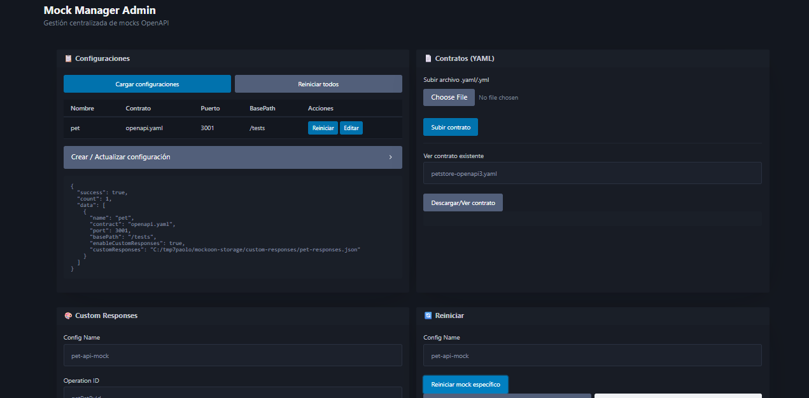

# Mock Manager - Manual de Usuario

Bienvenido a **Mock Manager**, una herramienta diseñada para la gestión centralizada y el despliegue dinámico de servidores _mock_ (simuladores de API) basados en contratos OpenAPI y Swagger. 

A través de un ligero panel de administración web, permite levantar múltiples APIs, asignar puertos y rutas base, además de personalizar sus respuestas basándose en los `operationId` definidos en los contratos.


---

## 📋 Tabla de Contenidos

1. [Requisitos Previos](#requisitos-previos)
2. [Instalación y Arranque](#instalación-y-arranque)
3. [Acceso al Panel de Administración](#acceso-al-panel-de-administración)
4. [Uso del Panel Web (Manual Práctico)](#uso-del-panel-web-manual-práctico)
    - [1. Configuraciones (Gestión de Mocks)](#1-configuraciones-gestión-de-mocks)
    - [2. Contratos (Archivos YAML)](#2-contratos-archivos-yaml)
    - [3. Custom Responses (Respuestas Personalizadas)](#3-custom-responses-respuestas-personalizadas)
5. [Estructura del Proyecto](#estructura-del-proyecto)
6. [Consideraciones Importantes](#consideraciones-importantes)

---

## Requisitos Previos

- **Node.js**: (Recomendado v16 o superior)
- **NPM** o Yarn para la instalación de dependencias.

---

## Instalación y Arranque

1. **Clonar o descargar** este repositorio en tu equipo.
2. Abre la consola de comandos en la carpeta raíz del proyecto y ejecuta:

   ```bash
   npm install
   ```
3. **Configurar el servidor principal**: Edita el archivo `src/config/server-config.json` para establecer el puerto en el que se levantará el panel de administración web y las rutas del sistema (*storage*) donde se almacenarán los contratos y configuraciones.
4. Una vez completado este proceso, arranca el servidor principal de Mock Manager:

   ```bash
   npm start
   ```
   *(Si estás trabajando en desarrollo y deseas reinicio automático frente a cambios, puedes usar `npm run dev`).*

---

## Acceso al Panel de Administración

Por defecto, la interfaz principal de Mock Manager estará disponible en:

👉 **[http://localhost:8000/admin](http://localhost:8000/admin)**

*(El puerto por defecto `8000` puede ser cambiado desde `src/config/server-config.json` o mediante variables de entorno).*

---

## Uso del Panel Web (Manual Práctico)



El panel web (`admin.html`) permite administrar el ciclo de vida de tus simuladores sin necesidad de tocar los archivos de código o reiniciar manualmente todo Node.js.

### 1. Configuraciones (Gestión de Mocks)
La sección "Configuraciones" actúa como el panel de control de tus simuladores de APIs. Cada "Configuración" representa un servidor virtual que responde según su propio contrato OpenAPI.

*   **Crear / Actualizar una configuración**:
    *   **Name**: Nombre identificador del mock (Ej. `pet-api-mock`).
    *   **Contract (YAML)**: El nombre del archivo OpenAPI ya subido previamente. (Ej. `petstore-openapi3.yaml`).
    *   **Port**: El puerto en el que este servicio Mock se debe arrancar (Ej. `3001`).
    *   **BasePath**: La ruta base compartida de los endpoints (Ej. `/api/pets`).
    *   **Enable Custom Responses**: 
        *   `true`: Intentará devolver una respuesta configurada manualmente en la sección de **Custom Responses**.
        *   `false`: Devolverá datos aleatorios auto-generados por la dependencia (*openapi-backend*) de acuerdo a las respuestas y esquemas predefinidos en el contrato YAML original.
*   **Acciones de Botones**:
    *   `Cargar configuraciones`: Muestra el estado y listado de mocks actuales en el archivo de JSON base.
    *   `Reiniciar todos`: Aplica cambios drásticos o carga manual forzada deteniendo y recreando los servidores mocks temporales y sus rutas.

### 2. Contratos (Archivos YAML)
Antes de crear una configuración de mock, necesitas subir el contrato que dictará las reglas, rutas y esquemas de los datos simulados.

*   **Subir archivo (.yaml/.yml)**: Permite examinar y cargar nuevos contratos al gestor (los almacena en `src/config/contracts/`).
*   **Ver Contrato Existente**: Escribe el nombre completo (`archivo.yaml`) para verificar el contenido parseado de manera rápida y corroborar que se ha subido correctamente.

### 3. Custom Responses (Respuestas Personalizadas)
Si activaste `Enable Custom Responses = true` en tus Mocks, en esta sección podrás anular la simulación aleatoria de un endpoint por un JSON fijo que devuelva lo que tú controles.

*   **Config Name**: Ingresa el *Name* de la Configuración donde deseas aplicar la regla (Ej. `pet-api-mock`).
*   **Operation ID**: Debes ingresar el valor de la clave `operationId` definida dentro del YAML de la API (`getPetById`, `addPet`, etc.).
*   **Response JSON**: Es la maqueta final que entregará el servidor. Debe poseer estrictamente este formato con estado HTTP y Cuerpo de JSON. Por ejemplo:
    ```json
    {
      "status": 200,
      "body": {
        "id": 99,
        "name": "Este es un dato de prueba manual"
      }
    }
    ```
*   **Crear/Actualizar:** Sobrescribirá las respuestas por defecto del mock con la tuya propia para ese puerto.

---

## Estructura del Proyecto

*   **`package.json`**: Dependencias de entorno y librerías clave (`openapi-backend`, `express`, `ajv`, etc).
*   **`src/server.js`**: Punto de entrada del Mock Manager general y de su API administrativa.
*   **`src/config/`**: Carpeta donde persistirá las configuraciones creadas desde el panel.
    *   `mocks-config.json`: Registra los mocks levantados y sus características.
    *   `server-config.json`: Archivo de configuración principal. Aquí se configuran los **valores por defecto** como la ubicación de la carpeta de contratos y el **puerto** donde se levanta el servidor del panel de administración.
    *   `contracts/`: Aquí se almacenarán físicamente los YAMLs subidos en la interfaz.
    *   `custom-responses/`: Contiene los JSON generados estáticos que usará el proxy de la API para devolver tus mocks configurados.
*   **`src/public/admin.html`**: Estructura del panel de control de interfaz de usuario frontal.
*   **`src/services/mockServices.js`**: El núcleo donde se registran los esquemas y las lógicas tras OpenAPI-backend.

---

## Consideraciones Importantes

1.  **CORS**: La herramienta expone cabeceras CORS de acceso público global (`*`), lo cual es seguro en entornos de desarrollo local pero debe manejarse con cuidado si se despliega globalmente.
2.  Si realizas modificaciones directas en los ficheros JSON bajo la carpeta `src/config/` por tu propia cuenta (sin usar el portal web), es clave ir al portal y aplicar el botón secundario **Reiniciar todos** para refrescar las ramas de Express en memoria.
3.  La validación de la definición del YAML interno requiere que los `operationId` existan formalmente dentro de tu Swagger.
